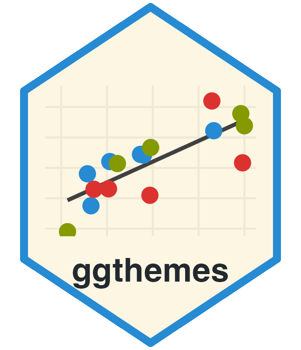

<!-- README.md is generated from README.Rmd. Please edit that file -->

```{r, echo = FALSE}
knitr::opts_chunk$set(
  collapse = TRUE,
  comment = "#>",
  fig.path = "man/figures/README-"
)
```

# ggthemes <a href="https://jrnold.github.io/ggthemes/"></a>

[](https://github.com/jrnold/ggthemes/actions/workflows/R-CMD-check.yaml)
[](https://app.codecov.io/github/jrnold/ggthemes?branch=main)
[](https://github.com/r-hub/cranlogs.app)
[](https://CRAN.R-project.org/package=ggthemes)
[](https://lifecycle.r-lib.org/articles/stages.html#stable)

Some extra geoms, scales, and themes for
[ggplot](https://ggplot2.tidyverse.org/).

## Install

To install the stable version from CRAN,

```r
install.packages('ggthemes', dependencies = TRUE)
```

Or, to install the development version from github, use the
**devtools** package,

```r
library("devtools")
install_github(c("hadley/ggplot2", "jrnold/ggthemes"))
```

## How to use

For a quick tutorial, check out [Rafael Irizarry's book](http://rafalab.dfci.harvard.edu/dsbook/ggplot2.html#add-on-packages).

## Examples

```{r setup-examples}
library("ggplot2")
library("ggthemes")

mtcars2 <- within(mtcars, {
  vs <- factor(vs, labels = c("V-shaped", "Straight"))
  am <- factor(am, labels = c("Automatic", "Manual"))
  cyl  <- factor(cyl)
  gear <- factor(gear)
})

p1 <- ggplot(mtcars2) +
  geom_point(aes(x = wt, y = mpg, colour = gear)) +
  labs(
    title = "Fuel economy falls with weight",
    x = "Weight (1000 lbs)",
    y = "Fuel economy (mpg)",
    colour = "Gears"
  )

# `theme_map()` intentionally removes axes, so use geographic data rather than
# a scatterplot. `theme_solid()` is likewise intended to leave only geoms.
us_states <- map_data("state")
p_map <- ggplot(us_states, aes(long, lat, group = group)) +
  geom_polygon(aes(fill = region), colour = "white", linewidth = 0.15) +
  coord_map("albers", lat0 = 39, lat1 = 45) +
  guides(fill = "none")

p_solid <- ggplot(mtcars2) +
  geom_point(aes(x = wt, y = mpg, colour = gear), size = 3) +
  guides(colour = "none")
```

```{r examples, echo = FALSE, results = "asis", message = FALSE, warning = FALSE}
# One row per exported theme, alphabetically. Each entry is the literal code
# shown in the table *and* the code evaluated to produce the figure beside it,
# so the two cannot drift apart. Themes that ship their own palette are paired
# with it; the rest borrow a general-purpose one.
examples <- list(
  theme_base = "p1 + theme_base() +\n  scale_colour_colourblind()",
  theme_calc = "p1 + theme_calc() +\n  scale_colour_calc()",
  theme_clean = "p1 + theme_clean() +\n  scale_colour_tableau()",
  theme_economist = "p1 + theme_economist() +\n  scale_colour_economist()",
  theme_excel = "p1 + theme_excel() +\n  scale_colour_excel()",
  theme_excel_new = "p1 + theme_excel_new() +\n  scale_colour_excel_new()",
  theme_few = "p1 + theme_few() +\n  scale_colour_few()",
  theme_fivethirtyeight = "p1 + theme_fivethirtyeight() +\n  scale_colour_fivethirtyeight()",
  theme_foundation = "p1 + theme_foundation() +\n  scale_colour_colourblind()",
  theme_gdocs = "p1 + theme_gdocs() +\n  scale_colour_gdocs()",
  theme_hc = "p1 + theme_hc() +\n  scale_colour_hc()",
  theme_igray = "p1 + theme_igray()",
  theme_map = "p_map +\n  theme_map()",
  theme_numbers = "p1 + theme_numbers() +\n  scale_colour_numbers()",
  theme_pander = "p1 + theme_pander() +\n  scale_colour_pander()",
  theme_par = "p1 + theme_par() +\n  scale_colour_colourblind()",
  theme_solarized = "p1 + theme_solarized() +\n  scale_colour_solarized()",
  theme_solarized_2 = "p1 + theme_solarized_2() +\n  scale_colour_solarized()",
  theme_solid = "p_solid +\n  theme_solid(fill = \"#202124\") +\n  scale_colour_colourblind()",
  theme_stata = "p1 + theme_stata() +\n  scale_colour_stata()",
  theme_tufte = "p1 + theme_tufte() +\n  scale_colour_few()",
  theme_wsj = "p1 + theme_wsj(base_size = 8) +\n  scale_colour_wsj()"
)

cat("<table>\n")
cat("<tr>",
    "<th align=\"left\">Theme</th>",
    "<th align=\"left\">Code</th>",
    "<th align=\"left\">Example</th>",
    "</tr>\n", sep = "")

for (nm in names(examples)) {
  code <- examples[[nm]]
  path <- paste0("man/figures/README-", nm, "-1.png")
  # A white background keeps themes that draw none (theme_map(), theme_tufte())
  # legible on dark-mode pages.
  ggsave(path, plot = eval(parse(text = code)), width = 6, height = 4, dpi = 96, bg = "white")
  cat(sprintf(
    "<tr>\n<td><code>%s</code></td>\n<td>\n\n```r\n%s\n```\n\n</td>\n<td></td>\n</tr>\n",
    nm, code, path, nm
  ))
}

cat("</table>\n")
```

## Color palettes

Every colour palette shipped with ggthemes is shown below. Each row is one
palette; the swatches are in the order returned by the corresponding palette
function. This compact, data-derived gallery follows the palette-overview
approach used by [ggpalettes](https://github.com/cran/ggpalettes) and the
one-palette-per-row display in [sjPlot](https://github.com/strengejacke/sjPlot).

```{r palettes, echo = FALSE, results = "asis", warning = FALSE}
# Keep this gallery tied to the package data, so palette additions and colour
# changes appear here automatically. Tableau's sequential and diverging rows
# show the colour stops used by its continuous scales.
pkgload::load_all(quiet = TRUE)

palette_rows <- list(
  "General" = list(
    "colorblind_pal(black = TRUE)" = colorblind_pal(black = TRUE)(8),
    "calc_pal()" = calc_pal()(12),
    "economist_pal(fill = FALSE)" = economist_pal(fill = FALSE)(9),
    "economist_pal(fill = TRUE)" = economist_pal(fill = TRUE)(9),
    "fivethirtyeight_pal()" = fivethirtyeight_pal()(3),
    "gdocs_pal()" = gdocs_pal()(24),
    "palette_pander(random_order = FALSE)" = palette_pander(8),
    "ptol_pal()" = ptol_pal()(12)
  ),
  "Canva" = setNames(
    lapply(names(canva_palettes), function(palette) canva_pal(palette)(4)),
    sprintf('canva_pal("%s")', names(canva_palettes))
  ),
  "Excel" = c(
    list("excel_pal(line = TRUE)" = excel_pal(TRUE)(7),
         "excel_pal(line = FALSE)" = excel_pal(FALSE)(7)),
    setNames(lapply(names(ggthemes_data$excel$themes), function(theme) {
      excel_new_pal(theme)(6)
    }), sprintf('excel_new_pal("%s")', names(ggthemes_data$excel$themes)))
  ),
  "Few" = setNames(
    lapply(names(ggthemes_data$few$colors), function(palette) few_pal(palette)(8)),
    sprintf('few_pal("%s")', names(ggthemes_data$few$colors))
  ),
  "Highcharts" = setNames(
    lapply(names(ggthemes_data$hc), function(palette) hc_pal(palette)(length(ggthemes_data$hc[[palette]]))),
    sprintf('hc_pal("%s")', names(ggthemes_data$hc))
  ),
  "Numbers" = setNames(
    lapply(names(ggthemes_data$numbers), function(palette) numbers_pal(palette)(6)),
    sprintf('numbers_pal("%s")', names(ggthemes_data$numbers))
  ),
  "Solarized" = setNames(
    lapply(names(ggthemes_data$solarized$palettes), function(accent) solarized_pal(accent)(8)),
    sprintf('solarized_pal("%s")', names(ggthemes_data$solarized$palettes))
  ),
  "Stata" = setNames(
    lapply(names(ggthemes_data$stata$colors$schemes), function(scheme) stata_pal(scheme)(15)),
    sprintf('stata_pal("%s")', names(ggthemes_data$stata$colors$schemes))
  ),
  "Tableau — discrete" = setNames(
    lapply(names(ggthemes_data$tableau$`color-palettes`$regular), function(palette) {
      x <- ggthemes_data$tableau$`color-palettes`$regular[[palette]]
      tableau_color_pal(palette, type = "regular")(nrow(x))
    }), sprintf('tableau_color_pal("%s")', names(ggthemes_data$tableau$`color-palettes`$regular))
  ),
  "Tableau — diverging" = setNames(
    lapply(ggthemes_data$tableau$`color-palettes`$`ordered-diverging`, `[[`, "value"),
    sprintf('tableau_div_gradient_pal("%s")', names(ggthemes_data$tableau$`color-palettes`$`ordered-diverging`))
  ),
  "Tableau — sequential" = setNames(
    lapply(ggthemes_data$tableau$`color-palettes`$`ordered-sequential`, `[[`, "value"),
    sprintf('tableau_seq_gradient_pal("%s")', names(ggthemes_data$tableau$`color-palettes`$`ordered-sequential`))
  ),
  "Wall Street Journal" = setNames(
    lapply(names(ggthemes_data$wsj$palettes), function(palette) {
      x <- ggthemes_data$wsj$palettes[[palette]]
      wsj_pal(palette)(nrow(x))
    }), sprintf('wsj_pal("%s")', names(ggthemes_data$wsj$palettes))
  )
)

html_escape <- function(x) {
  x <- gsub("&", "&amp;", x, fixed = TRUE)
  x <- gsub("<", "&lt;", x, fixed = TRUE)
  gsub(">", "&gt;", x, fixed = TRUE)
}

for (group in names(palette_rows)) {
  cat(sprintf("<h3>%s</h3>\n<table>\n", html_escape(group)))
  for (name in names(palette_rows[[group]])) {
    colours <- palette_rows[[group]][[name]]
    swatches <- paste(sprintf(
      '<td width="16" height="20" bgcolor="%s" title="%s">&nbsp;</td>',
      colours, colours
    ), collapse = "")
    cat(sprintf(
      '<tr><td><code>%s</code></td><td><table cellspacing="0" cellpadding="0"><tr>%s</tr></table></td></tr>\n',
      html_escape(name), swatches
    ))
  }
  cat("</table>\n")
}
```
