<!-- DO NOT EDIT README.md. It is created by README.Rmd -->

[](https://travis-ci.org/jrnold/ggthemes)
[](https://github.com/metacran/cranlogs.app)
[](http://cran.rstudio.com/web/packages/ggthemes)


# ggthemes


## Overview

Some extra geoms, scales, and themes for
[ggplot](http://ggplot2.org), including:

### Geoms

- ``geom_rangeframe`` : Tufte's range frame
- ``geom_tufteboxplot``: Tufte's box plot

### Themes 

- ``theme_calc``: a theme based on LibreOffice Calc.
- ``theme_economist``: a theme based on the plots in the [The Economist](http://www.economist.com/) magazine.
- ``theme_excel``: a theme replicating the classic ugly gray charts in Excel
- ``theme_few``: theme from Stephen Few's  ["Practical Rules for Using Color in Charts"](http://www.perceptualedge.com/articles/visual_business_intelligence/rules_for_using_color.pdf).
- ``theme_fivethirtyeight``: a theme based on the plots at [fivethirtyeight.com](http://fivethirtyeight.com).
- ``theme_gdocs``: a theme based on Google Docs.
- ``theme_hc``: a theme based on [Highcharts JS](http://www.highcharts.com).
- ``theme_pander``: a theme to use with the [pander](http://rapporter.github.io/pander/) package.
- ``theme_solarized``: a theme using the [solarized](http://ethanschoonover.com/solarized) color palette.
- ``theme_stata``: themes based on [Stata](http://www.stata.com/) graph schemes.
- ``theme_tufte``: a minimal ink theme based on Tufte's *The Visual Display of Quantitative Information*.
- ``theme_wsj``: a theme based on the plots in the [The Wall Street Journal](http://www.wsj.com/).

### Scales

- ``scale_colour_calc``, ``scale_shape_calc``: color and shape palettes from LibreOffice Calc.
- ``scale_colour_colorblind``: Colorblind safe palette from <http://jfly.iam.u-tokyo.ac.jp/color/>.
- ``scale_colour_economist``: colors used in plots in plots in *The Economist*.
- ``scale_colour_excel``: colors from new and old Excel.
- ``scale_colour_few``: color palettes from Stephen Few's ["Practical Rules for Using Color in Charts"](http://www.perceptualedge.com/articles/visual_business_intelligence/rules_for_using_color.pdf).
- ``scale_colour_gdocs``: color palette from Google Docs.
- ``scale_colour_hc``: a theme based on [Highcharts JS](http://www.highcharts.com).
- ``scale_colour_solarized``: [Solarized](http://ethanschoonover.com/solarized) colors
- ``scale_colour_stata``, ``scale_shapes_stata``, ``scale_linetype_stata``: color, shape, and linetype palettes from Stata graph schemes.
- ``scale_colour_tableau``, ``scale_shape_tableau``: color and shape palettes from [Tableau](http://www.tableau.com/).
- ``scale_colour_pander``, ``scale_fill_pander``: scales to use with the [pander](http://rapporter.github.io/pander/) package.
- ``scale_shape_cleveland``, ``scale_shape_tremmel``, ``scale_shape_circlefill``: shape scales from classic works in visual perception: Cleveland, Tremmel (1995), and Lewandowsky and Spence (1989).

Most of these scales also have associates palettes, as used  in the *scales* package.

### Miscellaneous

- `bank_slopes`: Find the optimal aspect ratio to bank slopes to 45 degrees

<!--  LocalWords:  geoms ggplot rangeframe Tufte's tufteboxplot calc
 -->
<!--  LocalWords:  LibreOffice Calc Few's fivethirtyeight gdocs hc JS
 -->
<!--  LocalWords:  Highcharts solarized stata Stata tufte wsj colour
 -->
<!--  LocalWords:  linetype cleveland tremmel circlefill Lewandowsky
 -->


## Install 

To install the stable version from CRAN,

```r
install.packages('ggthemes', dependencies = TRUE)
```

Or, to install the development version from github, use the
**devtools** package,

```r
library("devtools")
install_github(c("hadley/ggplot2", "jrnold/ggthemes"))
```

Note: at the moment the development version of **ggthemes** will *only* work with the development version of **ggplot2**, and is not compatible with the version of **ggplot2** on CRAN.


<!--  LocalWords:  CRAN 'ggthemes' github devtools jrnold ggthemes
 -->
<!--  LocalWords:  Rtools
 -->


## Contribute

Contributions are welcome! If you would like to add a theme, scales,
etc., fork the repository, add your theme, and submit a pull request.


# Examples


```r
library("ggplot2")
library("ggthemes")
dsamp <- diamonds[sample(nrow(diamonds), 1000), ]
diamond_plot <- 
  ggplot(dsamp, aes(x = carat, y = price, colour=cut)) +
  geom_point() +
  ggtitle("Diamonds Are Forever")
```

### Tufte theme and geoms

Minimal theme and geoms based on plots in *The Visual Display of Quantitative Information*.


```r
ggplot(mtcars, aes(x = wt, y = mpg)) +
  geom_point() +
  geom_rangeframe() +
  theme_tufte() + 
  scale_x_continuous(breaks = extended_range_breaks()(mtcars$wt)) +
  scale_y_continuous(breaks = extended_range_breaks()(mtcars$mpg))
```

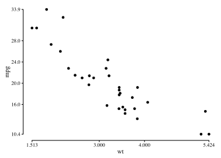 

The function `geom_tufteboxplot` creates several variants of Tufte's minimal-ink boxplots.
For a boxplot with a point indicating the median, a gap indicating the interquartile range,
and lines for whiskers:

```r
ggplot(mtcars, aes(factor(cyl), mpg))  +
 theme_tufte(ticks=FALSE) +
 geom_tufteboxplot()
```

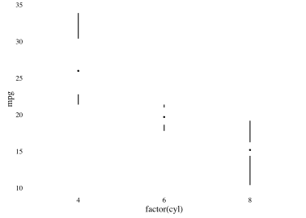 
For a boxplot with an offset line indicating the interquartile range and a gap indicating the median:

```r
(ggplot(mtcars, aes(factor(cyl), mpg)) 
 + theme_tufte(ticks=FALSE)
 + geom_tufteboxplot(median.type = "line")
)
```

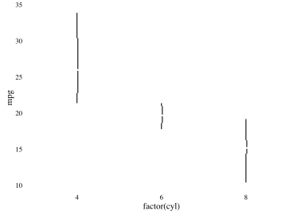 
For a boxplot with an line indicating the interquartile range, a gap indicating the median, and 
points indicating the minimum and maximum:

```r
(ggplot(mtcars, aes(factor(cyl), mpg)) 
 + theme_tufte(ticks=FALSE)
 + geom_tufteboxplot(median.type = "line", whisker.type = 'point', hoffset = 0)
)
```

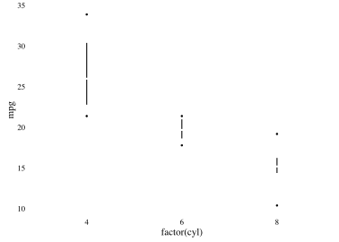 
For a boxplot with a wide line indicating the interquartile range, a gap indicating the median, and 
lines indicating the minimum and maximum

```r
(ggplot(mtcars, aes(factor(cyl), mpg)) 
 + theme_tufte(ticks=FALSE)
 + geom_tufteboxplot(median.type = "line", whisker.type = 'line', hoffset = 0,
                     width = 3)
)
```

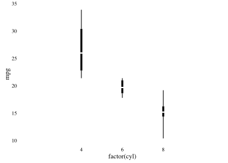 

### Economist theme

A theme that approximates the style of plots in The Economist
magazine.


```r
diamond_plot +
  theme_economist() +
  scale_colour_economist() 
```

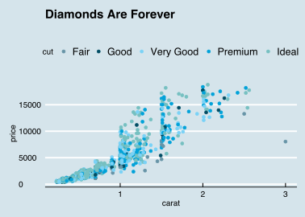 

### Solarized theme

A theme and color and fill scales based on the Solarized palette.

The light theme.


```r
diamond_plot +
  theme_solarized() +
  scale_colour_solarized("blue")
```

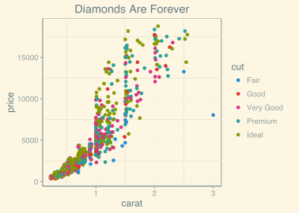 

The dark theme.


```r
diamond_plot +
  theme_solarized(light = FALSE) +
  scale_colour_solarized("red")
```

 

An alternative theme.


```r
diamond_plot +
  theme_solarized_2(light = FALSE) +
  scale_colour_solarized("blue")
```

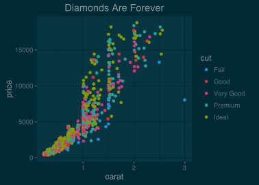 


### Stata theme 

Themes and scales (color, fill, linetype, shapes) based on the graph
schemes in Stata.


```r
ggplot(dsamp, aes(x = carat, y = price, colour = cut)) +
  geom_point() +
  theme_stata() +
  scale_colour_stata() +
  ggtitle("Plot Title")
```

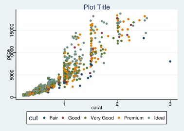 

### Excel 2003 theme

For that classic ugly look and feel. For ironic purposes only. 3D bars
and pies not included. Please never use this theme.


```r
ggplot(dsamp, aes(x = carat, y = price, colour = cut)) +
  geom_point() +
  theme_excel() +
  scale_colour_excel()
```

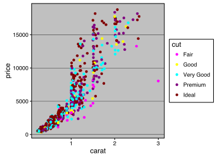 


```r
ggplot(diamonds, aes(x = clarity, fill = cut)) +
  geom_bar() +
  scale_fill_excel() +
  theme_excel()
```

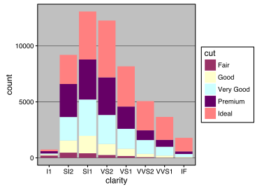 

### Inverse Gray Theme

Inverse of `theme_gray`, i.e. white plot area and gray background.


```r
ggplot(dsamp, aes(x = carat, y = price, colour=cut)) +
  geom_point() +
  theme_igray()
```

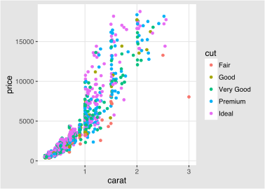 

### Fivethirtyeight theme

Theme and color palette based on the plots at [fivethirtyeight.com](http://fivethirtyeight.com).


```r
ggplot(subset(mtcars, cyl != 5),
       aes(x = hp, y = mpg, colour = factor(cyl))) +
  geom_point() +
  geom_smooth(method = "lm", se = FALSE) +
  scale_color_fivethirtyeight("cyl") +
  theme_fivethirtyeight()
```

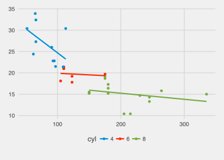 

### Tableau Scales

Color, fill, and shape scales based on those used in the Tableau software.


```r
ggplot(dsamp, aes(x = carat, y = price, colour=cut)) +
  geom_point() +
  theme_igray() +
  scale_colour_tableau()
```

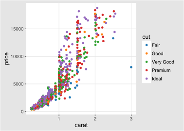 


```r
ggplot(dsamp, aes(x = carat, y = price, colour=cut)) +
  geom_point() +
  theme_igray() +
  scale_colour_tableau("colorblind10")
```

 

### Stephen Few's Practical Rules for Using Color ...

Color palette and theme based on Stephen Few's ["Practical Rules for Using Color in Charts"](http://www.perceptualedge.com/articles/visual_business_intelligence/rules_for_using_color.pdf).


```r
ggplot(dsamp, aes(x = carat, y = price, colour=cut)) +
  geom_point() +
  theme_few() +
  scale_colour_few()
```

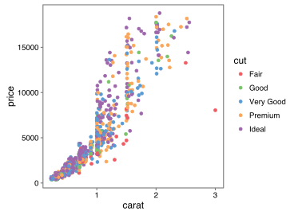 

### Wall Street Journal

Theme and some color palettes based on plots in the *The Wall Street Journal*.


```r
ggplot(dsamp, aes(x = carat, y = price, colour=cut)) +
  geom_point() +
  theme_wsj() +
  scale_colour_wsj("colors6", "") +
  ggtitle("Diamond Prices")
```

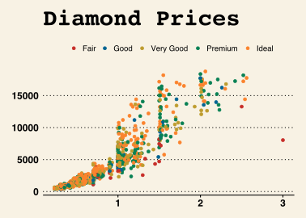 

### GDocs Theme

Theme and color palettes based on the defaults in Google Docs.


```r
ggplot(dsamp, aes(x = carat, y = price, colour = clarity)) +
  geom_point() +
  theme_gdocs() +
  ggtitle("Diamonds") +
  scale_color_gdocs()
```

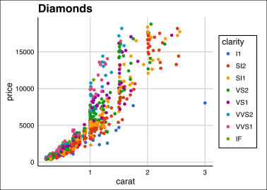 

### Calc Theme

Theme and color and shape palettes based on the defaults in LibreOffice Calc.


```r
ggplot(dsamp, aes(x = carat, y = price, colour=clarity)) +
  geom_point() +
  theme_calc() +
  ggtitle("Diamonds") +
  scale_color_calc()
```

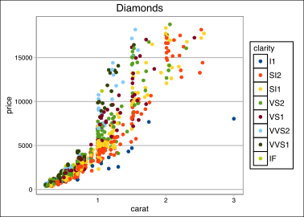 

### Pander Theme

Theme and color palettes based on the [pander package](http://rapporter.github.io/pander/).


```r
ggplot(dsamp, aes(x = carat, y = price, colour = clarity)) +
  geom_point() +
  theme_pander() +
  scale_colour_pander()
```

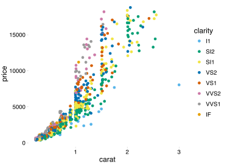 


```r
ggplot(dsamp, aes(x = clarity, fill = cut)) +
  geom_bar() +
  theme_pander() +
  scale_fill_pander()
```

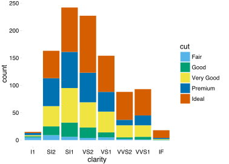 

### Highcharts  theme

A theme that approximates the style of plots in [Highcharts JS](http://www.highcharts.com/demo).


```r
(qplot(carat, price, data = dsamp, colour = cut)
 + theme_hc()
 + scale_colour_hc()
 + ggtitle("Diamonds Are Forever"))
```

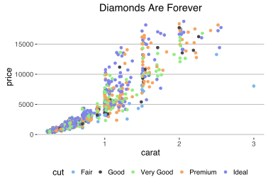 

```r
(qplot(carat, price, data = dsamp, colour = cut)
 + theme_hc(bgcolor = "darkunica")
 + scale_colour_hc("darkunica")
 + ggtitle("Diamonds Are Forever"))
```

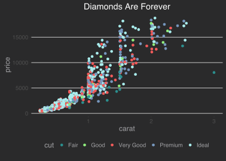 


```r
dtemp <- data.frame(months = factor(rep(substr(month.name,1,3), 4), levels = substr(month.name,1,3)),
                    city = rep(c("Tokyo", "New York", "Berlin", "London"), each = 12),
                    temp = c(7.0, 6.9, 9.5, 14.5, 18.2, 21.5, 25.2, 26.5, 23.3, 18.3, 13.9, 9.6,
                             -0.2, 0.8, 5.7, 11.3, 17.0, 22.0, 24.8, 24.1, 20.1, 14.1, 8.6, 2.5,
                             -0.9, 0.6, 3.5, 8.4, 13.5, 17.0, 18.6, 17.9, 14.3, 9.0, 3.9, 1.0,
                             3.9, 4.2, 5.7, 8.5, 11.9, 15.2, 17.0, 16.6, 14.2, 10.3, 6.6, 4.8))
```


```r
ggplot(dtemp, aes(x = months, y = temp, group = city, color = city)) +
  geom_line() +
  geom_point(size = 1.1) + 
  ggtitle("Monthly Average Temperature") +
  theme_hc() +
  scale_colour_hc()
```

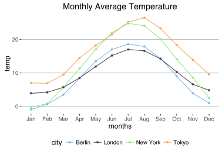 


```r
ggplot(dtemp, aes(x = months, y = temp, group = city, color = city)) +
  geom_line() + 
  geom_point(size = 1.1) + 
  ggtitle("Monthly Average Temperature") +
  theme_hc(bgcolor = "darkunica") +
  scale_fill_hc("darkunica")
```

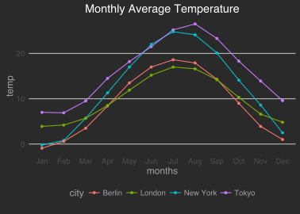 

## Maps theme

A theme useful for displaying maps.


```r
library("maps")
us <- fortify(map_data("state"), region = "region")
ggplot() +
  geom_map(data  =  us, map = us,
           aes(x = long, y = lat, map_id = region, group = group),
           fill = "white", color = "black", size = 0.25) +
  coord_map("albers", lat0 = 39, lat1 = 45) +
  theme_map()
```

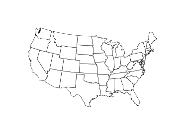 


<!--  LocalWords:  dsamp ggplot2 ggthemes nrow Tufte geoms tufte aes
 -->
<!--  LocalWords:  rangeframe ggplot mtcars boxplot tufteboxplot cyl
 -->
<!--  LocalWords:  qplot colour ggtitle Solarized solarized Stata 3D
 -->
<!--  LocalWords:  linetype stata excel1 excel2 igray Fivethirtyeight
 -->
<!--  LocalWords:  fivethirtyeight lm se colorbind10 colorblind10 wsj
 -->
<!--  LocalWords:  Few's colors6 GDocs gdocs Calc LibreOffice calc JS
 -->
<!--  LocalWords:  scatterplot barplot Highcharts hc darkunica dtemp
 -->
<!--  LocalWords:  bgcolor substr
 -->
