[](https://github.com/jrnold/ggthemes/actions)
[](https://ci.appveyor.com/project/jrnold/ggthemes)
[](https://codecov.io/github/jrnold/ggthemes?branch=master)
[](https://github.com/metacran/cranlogs.app)
[](http://cran.rstudio.com/web/packages/ggthemes)
[](https://www.tidyverse.org/lifecycle/#stable)


Some extra geoms, scales, and themes for
[ggplot](http://ggplot2.org).


## Install 

To install the stable version from CRAN,

```r
install.packages('ggthemes', dependencies = TRUE)
```

Or, to install the development version from github, use the
**devtools** package,

```r
library("devtools")
install_github(c("hadley/ggplot2", "jrnold/ggthemes"))
```

## How to use

For a quick tutorial, check out [Rafael Irizarry's book](https://rafalab.github.io/dsbook/ggplot2.html#add-on-packages). For more examples [click here](https://github.com/BTJ01/ggthemes/tree/master/inst/examples).


## Previews

Previews provided below using the popular `mtcars` & `diamonds` datasets:

<table>
 <tr>
    <td>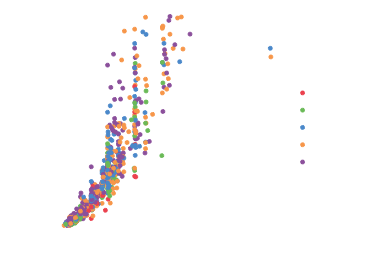
        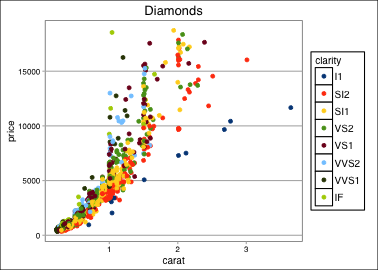
        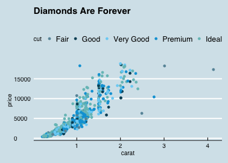
        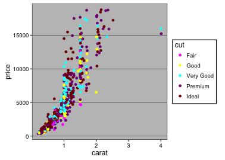
        
        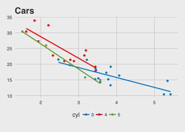
        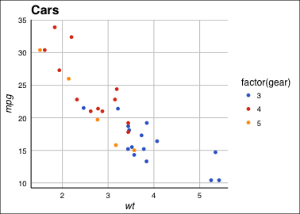
        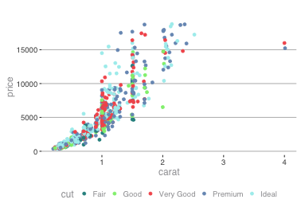
        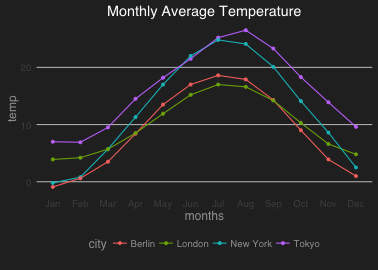
        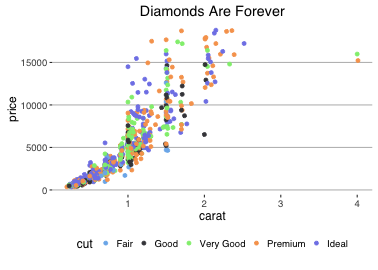
        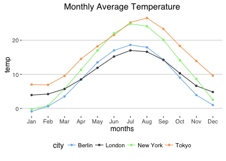
        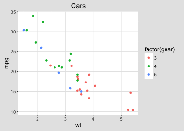
        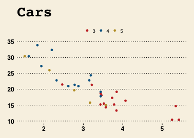
        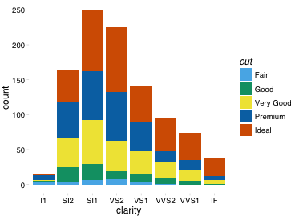
    </td>
    <td>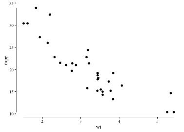
        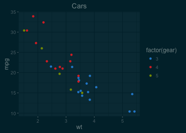
        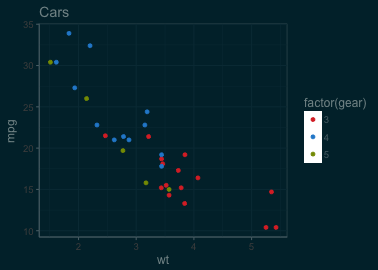
        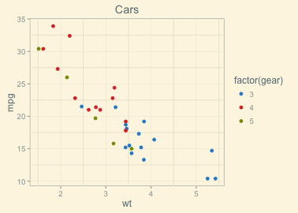
        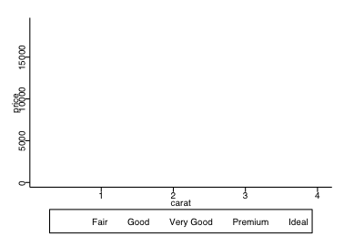
        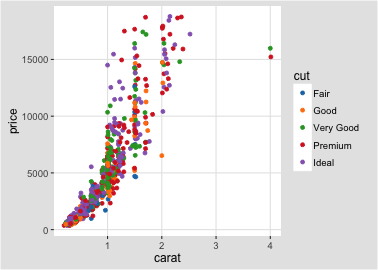
        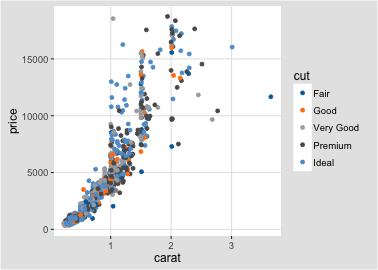
        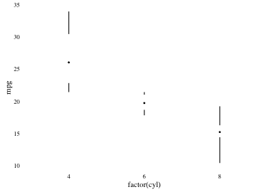
        
        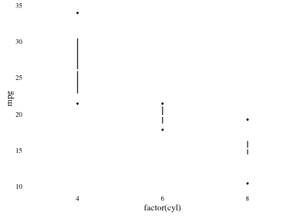
        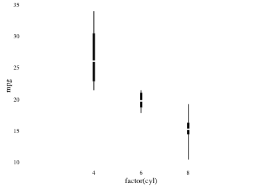
        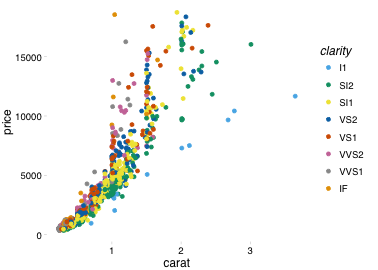
        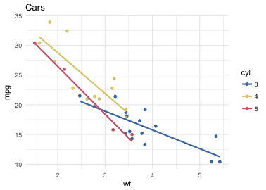
        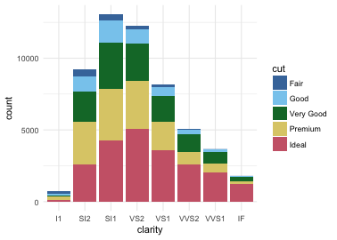
   </td>
 </tr>
</table>


