<!-- README.md is generated from README.Rmd. Please edit that file -->

[](https://github.com/jrnold/ggthemes/actions/workflows/R-CMD-check.yaml)
[](https://codecov.io/github/jrnold/ggthemes?branch=main)
[](https://github.com/metacran/cranlogs.app)
[](https://CRAN.R-project.org/package=ggthemes)
[](https://www.tidyverse.org/lifecycle/#stable)

Some extra geoms, scales, and themes for
[ggplot](https://ggplot2.tidyverse.org/).

## Install

To install the stable version from CRAN,

``` r
install.packages('ggthemes', dependencies = TRUE)
```

Or, to install the development version from github, use the **devtools**
package,

``` r
library("devtools")
install_github(c("hadley/ggplot2", "jrnold/ggthemes"))
```

## How to use

For a quick tutorial, check out [Rafael Irizarry’s
book](https://rafalab.github.io/dsbook/ggplot2.html#add-on-packages).

## Examples

``` r
library("ggplot2")
library("ggthemes")

mtcars2 <- within(mtcars, {
  vs <- factor(vs, labels = c("V-shaped", "Straight"))
  am <- factor(am, labels = c("Automatic", "Manual"))
  cyl  <- factor(cyl)
  gear <- factor(gear)
})

p1 <- ggplot(mtcars2) +
  geom_point(aes(x = wt, y = mpg, colour = gear)) +
  labs(
    title = "Fuel economy declines as weight increases",
    subtitle = "(1973-74)",
    caption = "Data from the 1974 Motor Trend US magazine.",
    x = "Weight (1000 lbs)",
    y = "Fuel economy (mpg)",
    colour = "Gears"
  )
```

``` r
p1 +
  scale_color_calc() +
  theme_calc()
```

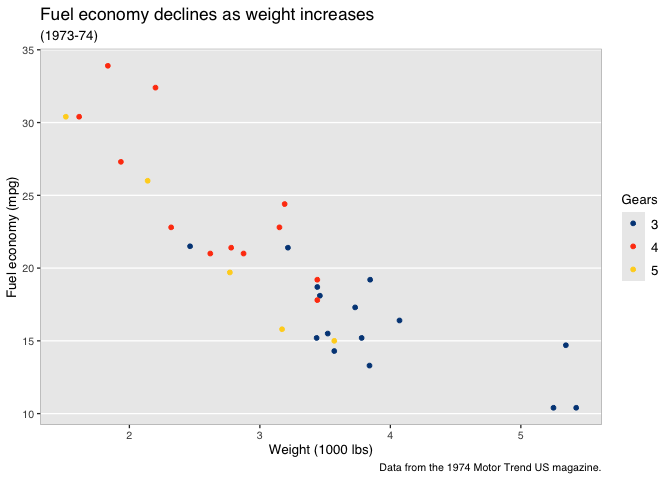<!-- -->

``` r
p1 + theme_clean()
```

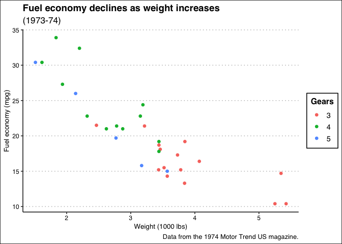<!-- -->

``` r
p1 + theme_economist() +
  scale_colour_economist()
```

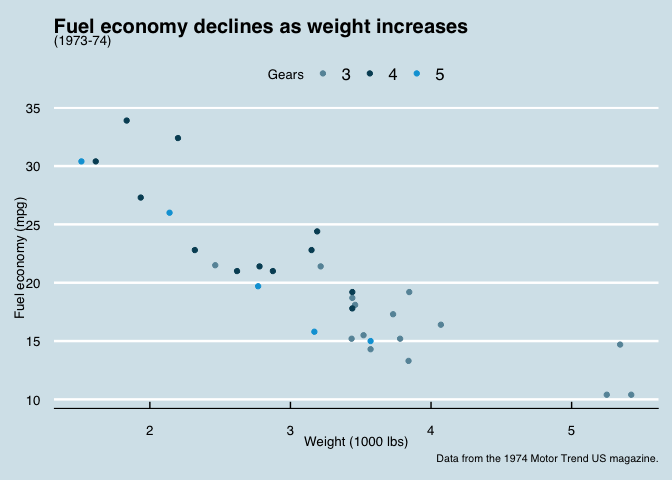<!-- -->

``` r
p1 + theme_excel() +
  scale_colour_excel()
```

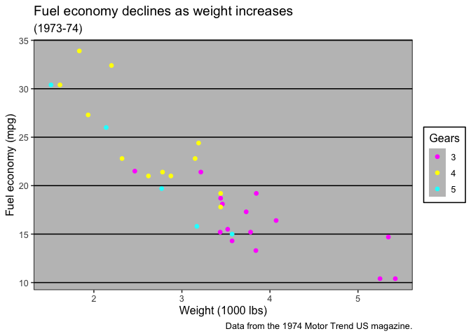<!-- -->

``` r
p1 + theme_excel_new() +
  scale_colour_excel_new()
```

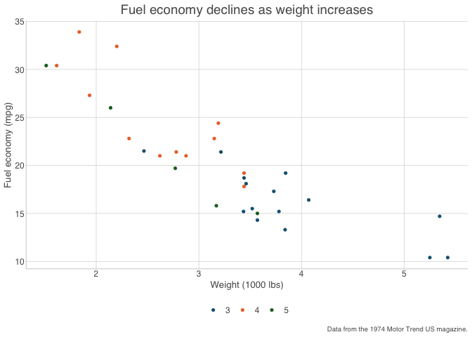<!-- -->

``` r
p1 + theme_igray()
```

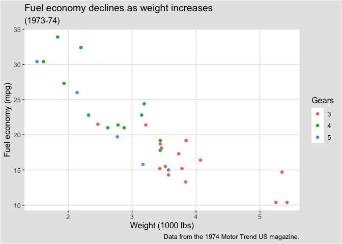<!-- -->

``` r
p1 + theme_par()
```

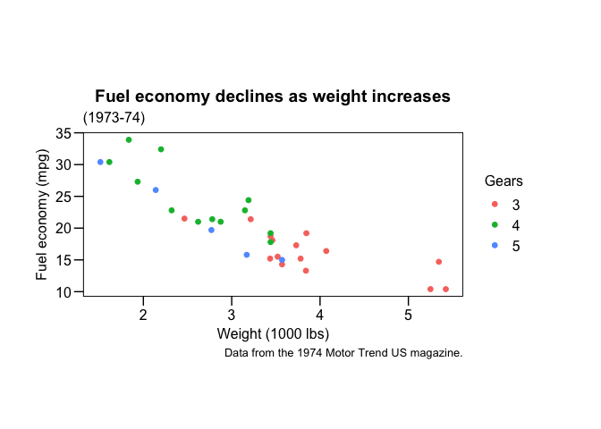<!-- -->

``` r
p1 + theme_fivethirtyeight()
```

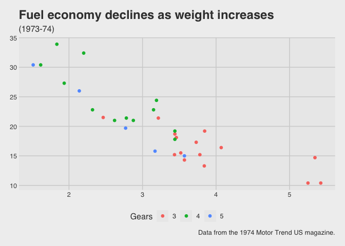<!-- -->

``` r
p1 + theme_few() +
  scale_colour_few()
```

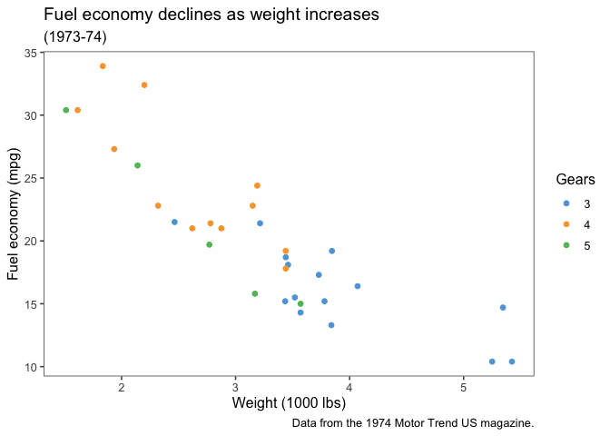<!-- -->

``` r
p1 + theme_solarized() +
  scale_colour_solarized()
```

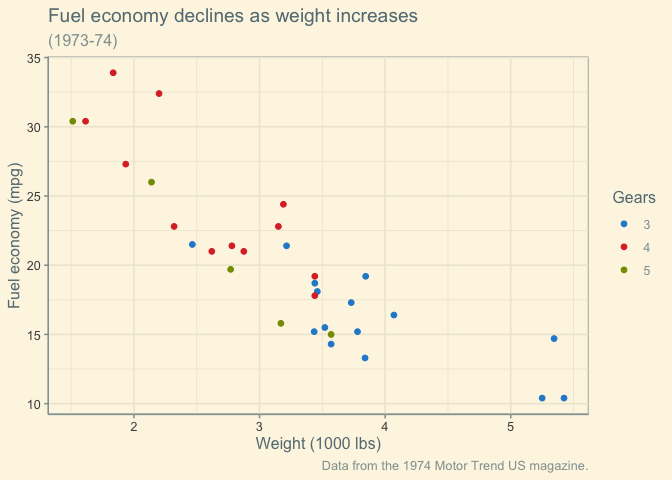<!-- -->

``` r
p1 + theme_solarized(light=FALSE) +
  scale_colour_solarized()
```

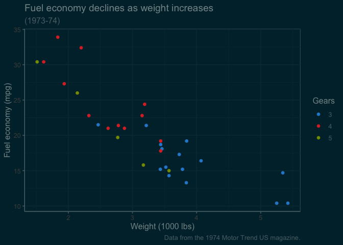<!-- -->

``` r
p1 + theme_solid()
```

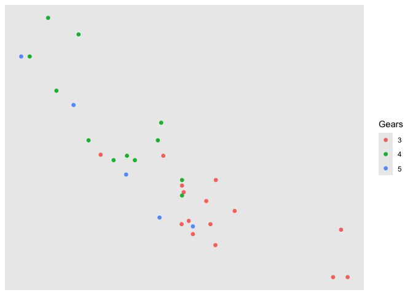<!-- -->

``` r
p1 + theme_tufte()
```

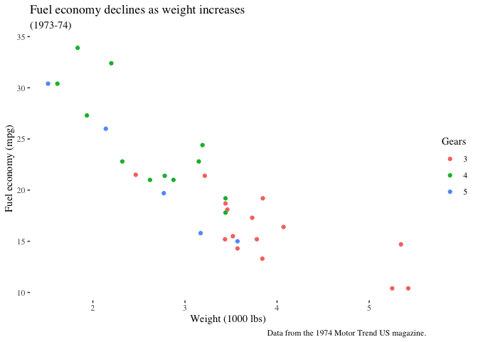<!-- -->

``` r
p1 + theme_wsj(base_size = 8) + scale_color_wsj()
```

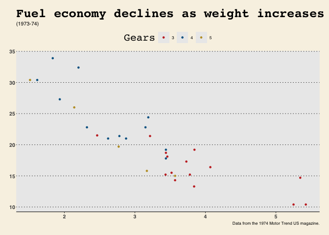<!-- -->

``` r
p1 + scale_color_colorblind()
```

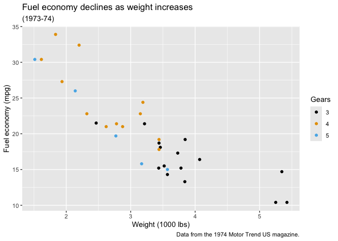<!-- -->

``` r
p1 + scale_color_tableau()
```

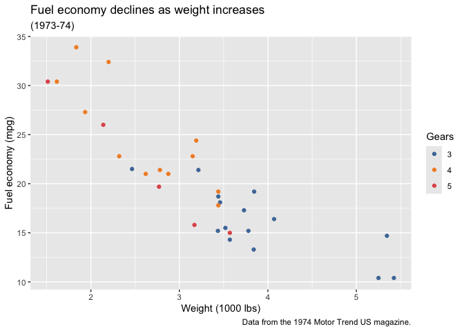<!-- -->
