<!-- README.md is generated from README.Rmd. Please edit that file -->

# ggthemes <a href="https://jrnold.github.io/ggthemes/"></a>

[](https://github.com/jrnold/ggthemes/actions/workflows/R-CMD-check.yaml)
[](https://app.codecov.io/github/jrnold/ggthemes?branch=main)
[](https://www.r-pkg.org/pkg/ggthemes)
[](https://CRAN.R-project.org/package=ggthemes)
[](https://lifecycle.r-lib.org/articles/stages.html#stable)

ggthemes adds themes, scales and geoms to
[ggplot2](https://ggplot2.tidyverse.org/) that reproduce the look of
well-known publications and software, and of the graphics advocated by
Edward Tufte and Stephen Few:

- **Themes** after *The Economist*, *The Wall Street Journal*,
  FiveThirtyEight, Excel, LibreOffice Calc, Google Docs, Highcharts,
  Apple Numbers, Stata, Solarized, base R graphics and more.
- **Color, shape and linetype scales and palettes** to match, including
  colorblind-safe and Tableau palettes. See the [palette
  gallery](https://jrnold.github.io/ggthemes/articles/palettes.html).
- **Geoms** for Tufte’s range frames and minimal box plots, and tools
  for [banking to
  45°](https://jrnold.github.io/ggthemes/reference/bank_slopes.html) to
  choose a plot’s aspect ratio.

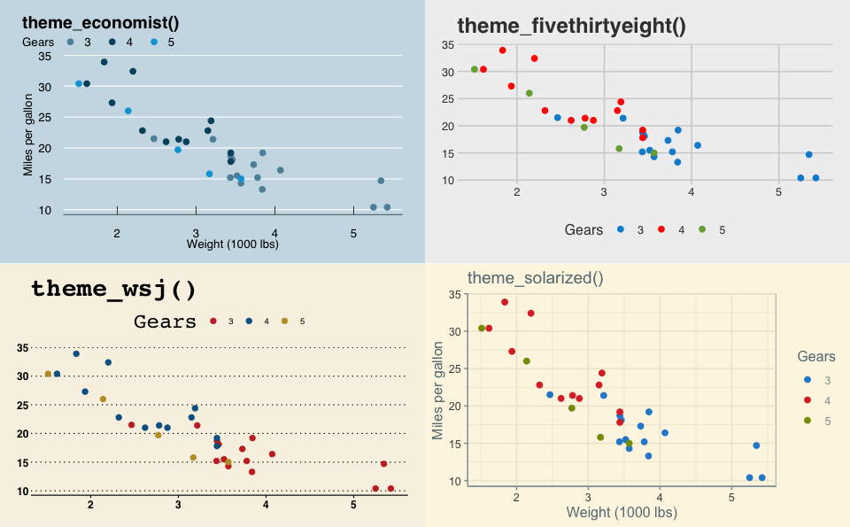

## Installation

Install the released version from CRAN:

``` r
install.packages("ggthemes")
```

Or the development version from GitHub:

``` r
# install.packages("pak")
pak::pak("jrnold/ggthemes")
```

## Themes

Every theme is shown below with its matching color scale, where it has
one. Each figure links to the theme’s reference page.

<details>

<summary>

Data and base plots used in the examples
</summary>

``` r
library("ggplot2")
library("ggthemes")

mtcars2 <- within(mtcars, {
  vs <- factor(vs, labels = c("V-shaped", "Straight"))
  am <- factor(am, labels = c("Automatic", "Manual"))
  cyl  <- factor(cyl)
  gear <- factor(gear)
})

p1 <- ggplot(mtcars2) +
  geom_point(aes(x = wt, y = mpg, colour = gear)) +
  labs(
    title = "Fuel economy falls with weight",
    x = "Weight (1000 lbs)",
    y = "Fuel economy (mpg)",
    colour = "Gears"
  )

# `theme_map()` intentionally removes axes, so use geographic data rather than
# a scatterplot. `theme_solid()` is likewise intended to leave only geoms.
us_states <- map_data("state")
p_map <- ggplot(us_states, aes(long, lat, group = group)) +
  geom_polygon(aes(fill = region), colour = "white", linewidth = 0.15) +
  coord_map("albers", lat0 = 39, lat1 = 45) +
  guides(fill = "none")

p_solid <- ggplot(mtcars2) +
  geom_point(aes(x = wt, y = mpg, colour = gear), size = 3) +
  guides(colour = "none")
```

</details>

<table>

<tr>

<td valign="top" width="50%">

<a href="https://jrnold.github.io/ggthemes/reference/theme_base.html">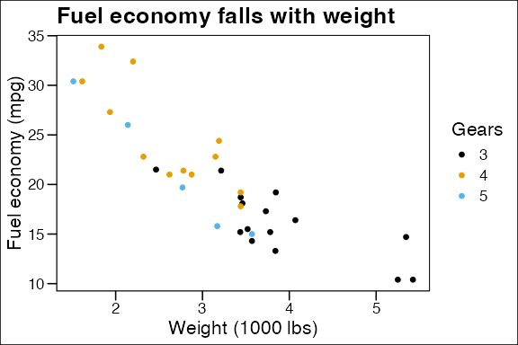</a>

``` r
p1 + theme_base() +
  scale_colour_colourblind()
```

</td>

<td valign="top" width="50%">

<a href="https://jrnold.github.io/ggthemes/reference/theme_calc.html">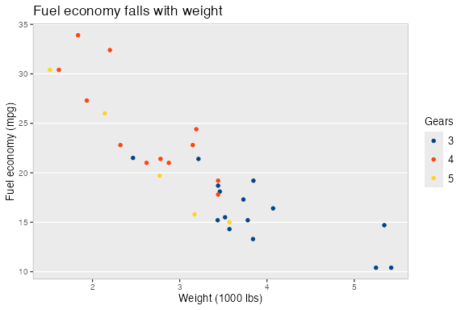</a>

``` r
p1 + theme_calc() +
  scale_colour_calc()
```

</td>

</tr>

<tr>

<td valign="top" width="50%">

<a href="https://jrnold.github.io/ggthemes/reference/theme_clean.html">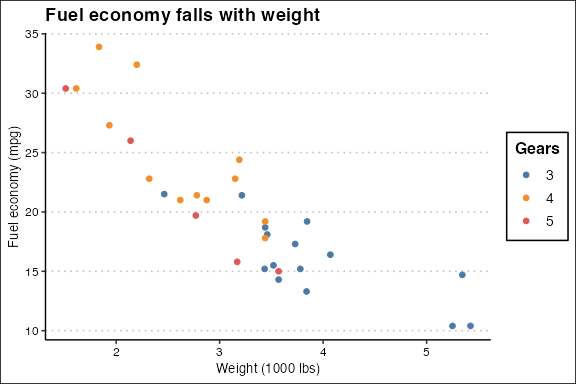</a>

``` r
p1 + theme_clean() +
  scale_colour_tableau()
```

</td>

<td valign="top" width="50%">

<a href="https://jrnold.github.io/ggthemes/reference/theme_economist.html">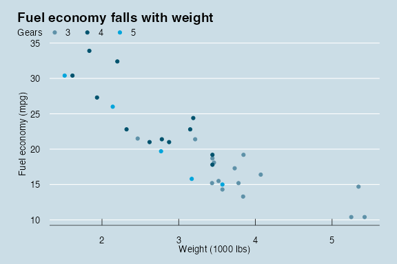</a>

``` r
p1 + theme_economist() +
  scale_colour_economist()
```

</td>

</tr>

<tr>

<td valign="top" width="50%">

<a href="https://jrnold.github.io/ggthemes/reference/theme_excel.html">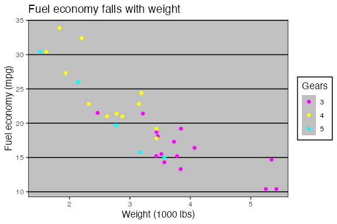</a>

``` r
p1 + theme_excel() +
  scale_colour_excel()
```

</td>

<td valign="top" width="50%">

<a href="https://jrnold.github.io/ggthemes/reference/theme_excel_new.html">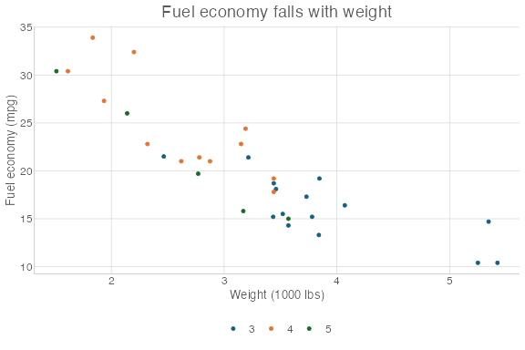</a>

``` r
p1 + theme_excel_new() +
  scale_colour_excel_new()
```

</td>

</tr>

<tr>

<td valign="top" width="50%">

<a href="https://jrnold.github.io/ggthemes/reference/theme_few.html">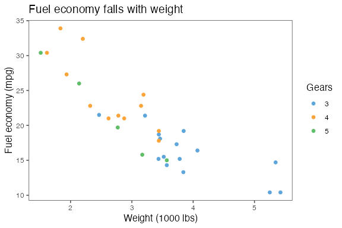</a>

``` r
p1 + theme_few() +
  scale_colour_few()
```

</td>

<td valign="top" width="50%">

<a href="https://jrnold.github.io/ggthemes/reference/theme_fivethirtyeight.html">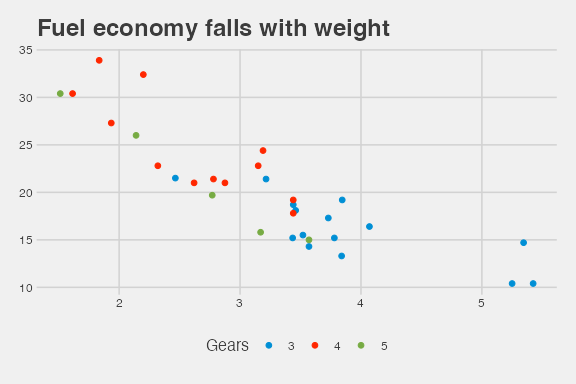</a>

``` r
p1 + theme_fivethirtyeight() +
  scale_colour_fivethirtyeight()
```

</td>

</tr>

<tr>

<td valign="top" width="50%">

<a href="https://jrnold.github.io/ggthemes/reference/theme_foundation.html">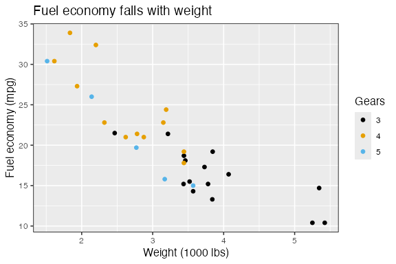</a>

``` r
p1 + theme_foundation() +
  scale_colour_colourblind()
```

</td>

<td valign="top" width="50%">

<a href="https://jrnold.github.io/ggthemes/reference/theme_gdocs.html">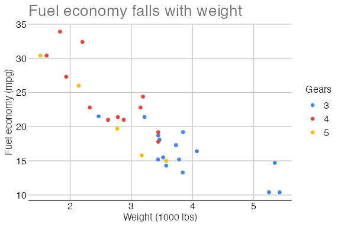</a>

``` r
p1 + theme_gdocs() +
  scale_colour_gdocs()
```

</td>

</tr>

<tr>

<td valign="top" width="50%">

<a href="https://jrnold.github.io/ggthemes/reference/theme_hc.html">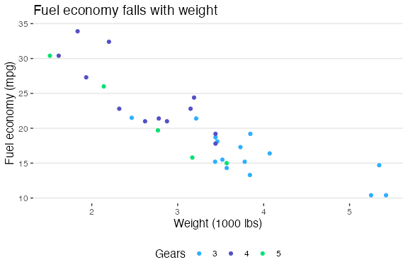</a>

``` r
p1 + theme_hc() +
  scale_colour_hc()
```

</td>

<td valign="top" width="50%">

<a href="https://jrnold.github.io/ggthemes/reference/theme_igray.html">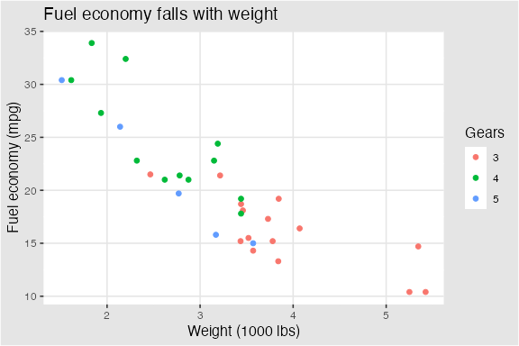</a>

``` r
p1 + theme_igray()
```

</td>

</tr>

<tr>

<td valign="top" width="50%">

<a href="https://jrnold.github.io/ggthemes/reference/theme_map.html">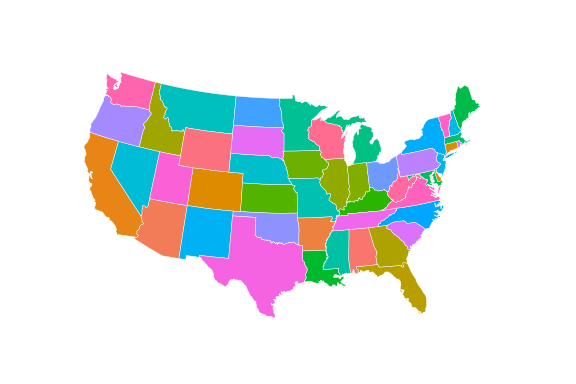</a>

``` r
p_map +
  theme_map()
```

</td>

<td valign="top" width="50%">

<a href="https://jrnold.github.io/ggthemes/reference/theme_numbers.html">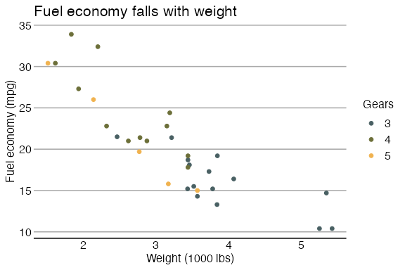</a>

``` r
p1 + theme_numbers() +
  scale_colour_numbers()
```

</td>

</tr>

<tr>

<td valign="top" width="50%">

<a href="https://jrnold.github.io/ggthemes/reference/theme_pander.html">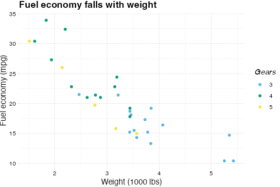</a>

``` r
p1 + theme_pander() +
  scale_colour_pander()
```

</td>

<td valign="top" width="50%">

<a href="https://jrnold.github.io/ggthemes/reference/theme_par.html">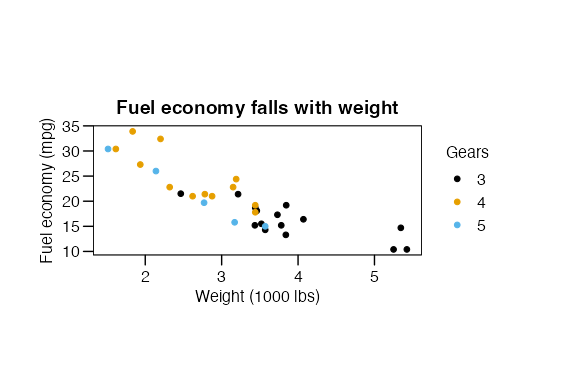</a>

``` r
p1 + theme_par() +
  scale_colour_colourblind()
```

</td>

</tr>

<tr>

<td valign="top" width="50%">

<a href="https://jrnold.github.io/ggthemes/reference/theme_solarized.html">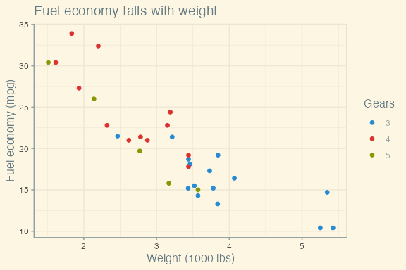</a>

``` r
p1 + theme_solarized() +
  scale_colour_solarized()
```

</td>

<td valign="top" width="50%">

<a href="https://jrnold.github.io/ggthemes/reference/theme_solarized.html">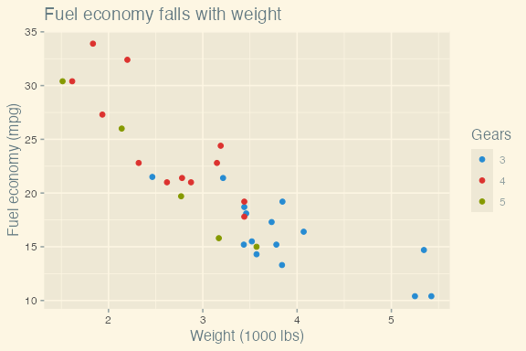</a>

``` r
p1 + theme_solarized_2() +
  scale_colour_solarized()
```

</td>

</tr>

<tr>

<td valign="top" width="50%">

<a href="https://jrnold.github.io/ggthemes/reference/theme_solid.html">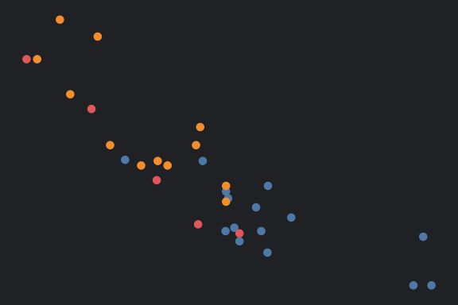</a>

``` r
p_solid +
  theme_solid(fill = "#202124") +
  scale_colour_tableau()
```

</td>

<td valign="top" width="50%">

<a href="https://jrnold.github.io/ggthemes/reference/theme_stata.html">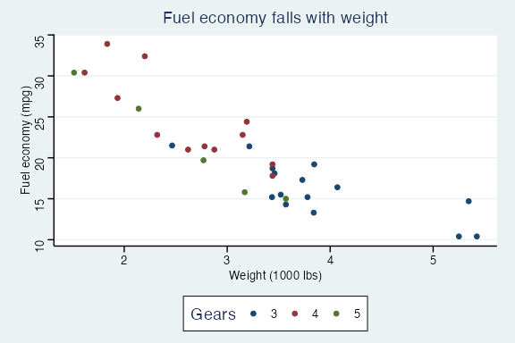</a>

``` r
p1 + theme_stata() +
  scale_colour_stata()
```

</td>

</tr>

<tr>

<td valign="top" width="50%">

<a href="https://jrnold.github.io/ggthemes/reference/theme_tufte.html">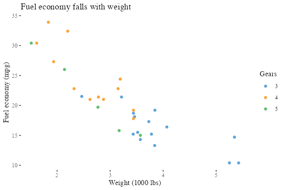</a>

``` r
p1 + theme_tufte() +
  scale_colour_few()
```

</td>

<td valign="top" width="50%">

<a href="https://jrnold.github.io/ggthemes/reference/theme_wsj.html">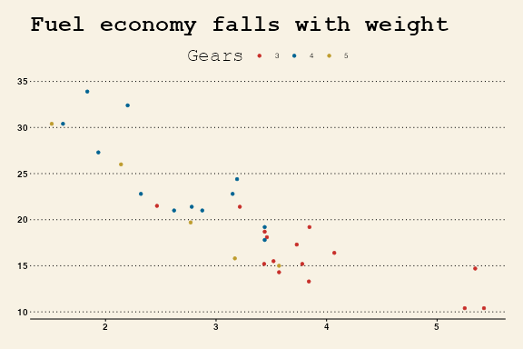</a>

``` r
p1 + theme_wsj(base_size = 8) +
  scale_colour_wsj()
```

</td>

</tr>

</table>

## Color palettes

A sample of the color palettes is shown below. The [palette
gallery](https://jrnold.github.io/ggthemes/articles/palettes.html) shows
every palette in the package.

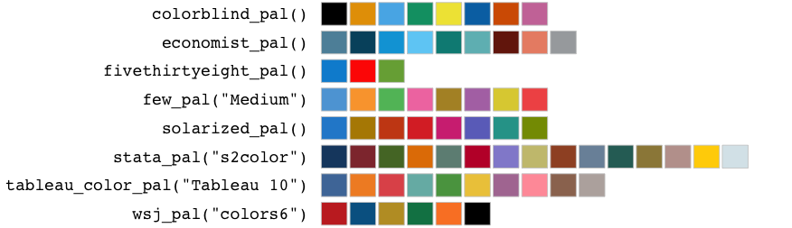

## Geoms

`geom_rangeframe()` draws Tufte’s range frame, axis lines that span only
the range of the data. `geom_tufteboxplot()` draws his minimal box plot.

``` r
ggplot(mtcars, aes(wt, mpg)) +
  geom_point() +
  geom_rangeframe() +
  coord_cartesian(clip = "off") +
  labs(x = "Weight (1000 lbs)", y = "Miles per gallon") +
  theme_tufte()

ggplot(mtcars, aes(factor(cyl), mpg)) +
  geom_tufteboxplot() +
  labs(x = "Cylinders", y = "Miles per gallon") +
  theme_tufte()
```

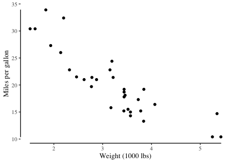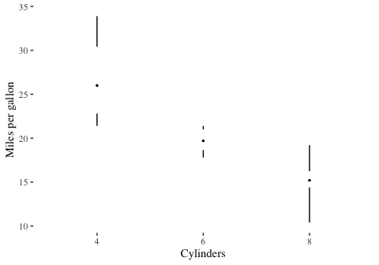

## Learn more

- The [reference pages](https://jrnold.github.io/ggthemes/reference/)
  document every theme, scale, palette and geom, with examples.
- The [palette
  gallery](https://jrnold.github.io/ggthemes/articles/palettes.html)
  shows every color palette.
- For a tutorial that uses ggthemes, see the [add-on packages
  section](http://rafalab.dfci.harvard.edu/dsbook/ggplot2.html#add-on-packages)
  of Rafael Irizarry’s *Introduction to Data Science*.
