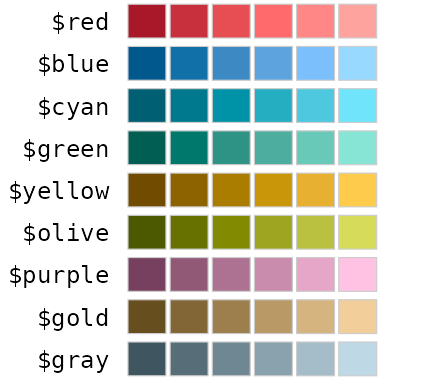
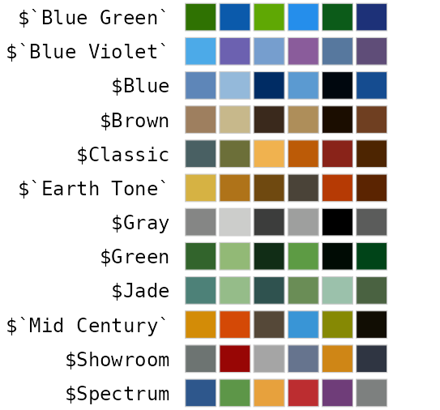
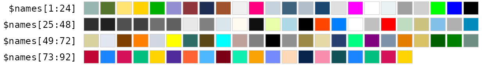
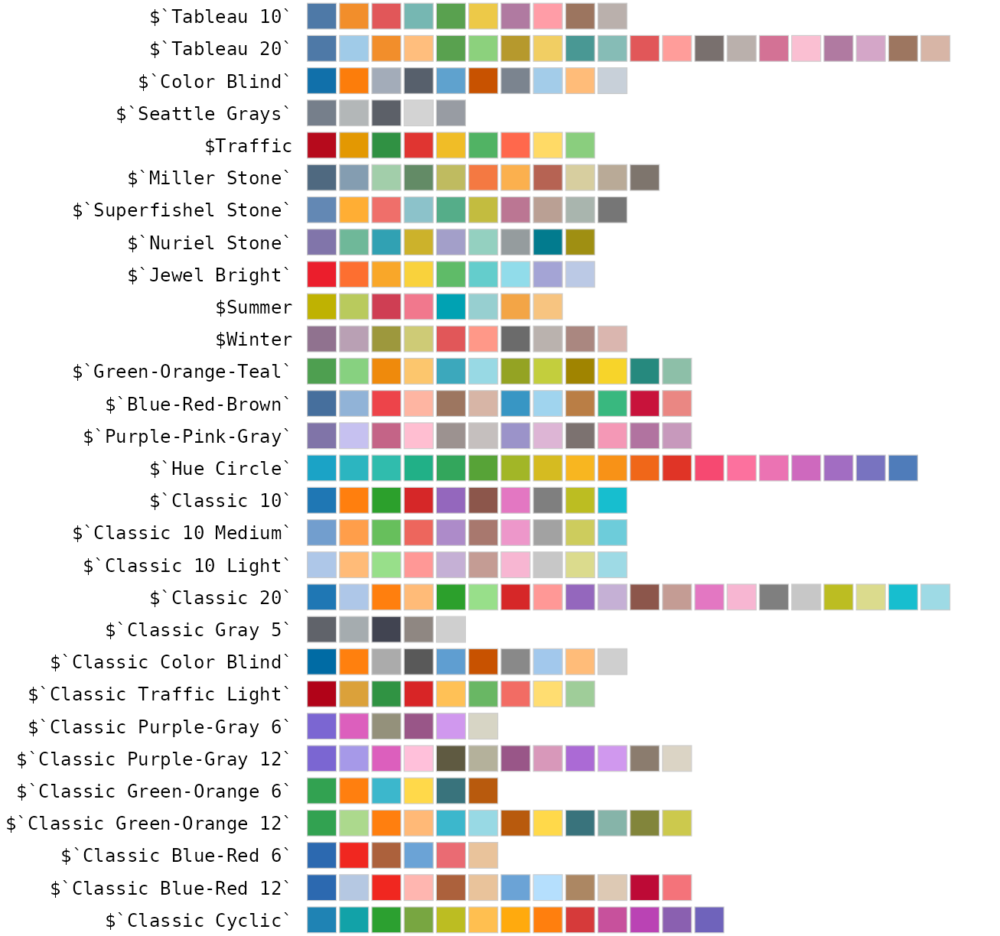
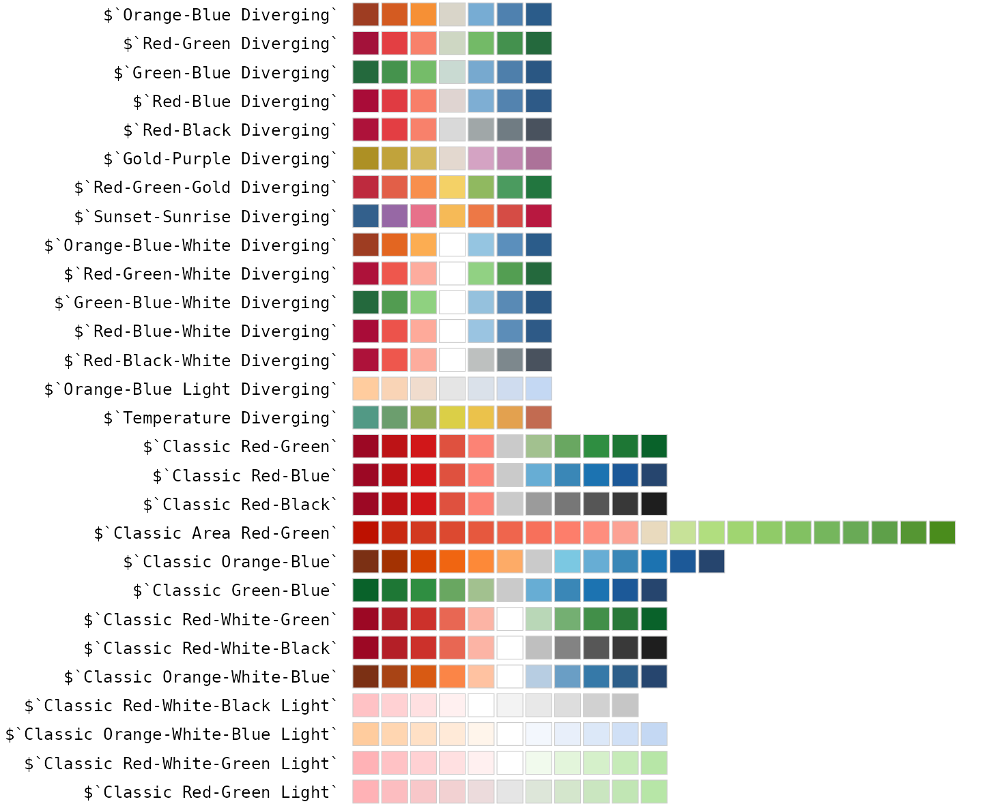

# Package data

`ggthemes_data` holds the raw values behind the package’s themes,
palettes and scales: every color, shape and linetype, as transcribed
from each source. This page draws all of them straight from the data.

The page follows the structure of the list: one section per theme, and
an indented block for each list inside it, so the deeper a list is
nested, the further it is indented. Under each heading is the R
expression that returns that list, and each row is labeled with the last
step of the expression, so any value shown here can be copied out. Long
sets are wrapped, with the positions in each row given in brackets.

Where a palette is stored once per number of colors, as the Solarized
and Paul Tol palettes are, only the largest is shown. For the palette
functions built on this data, see the [color
palettes](https://jrnold.github.io/ggthemes/articles/palettes.md)
gallery.

`ggthemes_data` contains no fonts: themes set their typefaces in code,
through their `base_family` argument.

## `ggthemes_data$calc`

## `ggthemes_data$economist`

### `$scales`

`ggthemes_data$economist$scales`

## `ggthemes_data$excel`

### `$classic`

`ggthemes_data$excel$classic`

### `$themes`

`ggthemes_data$excel$themes`

#### `$Atlas`

`ggthemes_data$excel$themes$Atlas`

#### `$hlink`

`ggthemes_data$excel$themes$Atlas$hlink`

#### `$Badge`

`ggthemes_data$excel$themes$Badge`

#### `$hlink`

`ggthemes_data$excel$themes$Badge$hlink`

#### `$Berlin`

`ggthemes_data$excel$themes$Berlin`

#### `$hlink`

`ggthemes_data$excel$themes$Berlin$hlink`

#### `$Celestial`

`ggthemes_data$excel$themes$Celestial`

#### `$hlink`

`ggthemes_data$excel$themes$Celestial$hlink`

#### `$Crop`

`ggthemes_data$excel$themes$Crop`

#### `$hlink`

`ggthemes_data$excel$themes$Crop$hlink`

#### `$Depth`

`ggthemes_data$excel$themes$Depth`

#### `$hlink`

`ggthemes_data$excel$themes$Depth$hlink`

#### `$Droplet`

`ggthemes_data$excel$themes$Droplet`

#### `$hlink`

`ggthemes_data$excel$themes$Droplet$hlink`

#### `$Facet`

`ggthemes_data$excel$themes$Facet`

#### `$hlink`

`ggthemes_data$excel$themes$Facet$hlink`

#### `$Feathered`

`ggthemes_data$excel$themes$Feathered`

#### `$hlink`

`ggthemes_data$excel$themes$Feathered$hlink`

#### `$Gallery`

`ggthemes_data$excel$themes$Gallery`

#### `$hlink`

`ggthemes_data$excel$themes$Gallery$hlink`

#### `$Headlines`

`ggthemes_data$excel$themes$Headlines`

#### `$hlink`

`ggthemes_data$excel$themes$Headlines$hlink`

#### `$Integral`

`ggthemes_data$excel$themes$Integral`

#### `$hlink`

`ggthemes_data$excel$themes$Integral$hlink`

#### `` $`Ion Boardroom` ``

`` ggthemes_data$excel$themes$`Ion Boardroom` ``

#### `$hlink`

`` ggthemes_data$excel$themes$`Ion Boardroom`$hlink ``

#### `$Ion`

`ggthemes_data$excel$themes$Ion`

#### `$hlink`

`ggthemes_data$excel$themes$Ion$hlink`

#### `$Madison`

`ggthemes_data$excel$themes$Madison`

#### `$hlink`

`ggthemes_data$excel$themes$Madison$hlink`

#### `` $`Main Event` ``

`` ggthemes_data$excel$themes$`Main Event` ``

#### `$hlink`

`` ggthemes_data$excel$themes$`Main Event`$hlink ``

#### `$Mesh`

`ggthemes_data$excel$themes$Mesh`

#### `$hlink`

`ggthemes_data$excel$themes$Mesh$hlink`

#### `$Office`

`ggthemes_data$excel$themes$Office`

#### `$hlink`

`ggthemes_data$excel$themes$Office$hlink`

#### `` $`Office 2013` ``

`` ggthemes_data$excel$themes$`Office 2013` ``

#### `$hlink`

`` ggthemes_data$excel$themes$`Office 2013`$hlink ``

#### `$Organic`

`ggthemes_data$excel$themes$Organic`

#### `$hlink`

`ggthemes_data$excel$themes$Organic$hlink`

#### `$Parallax`

`ggthemes_data$excel$themes$Parallax`

#### `$hlink`

`ggthemes_data$excel$themes$Parallax$hlink`

#### `$Parcel`

`ggthemes_data$excel$themes$Parcel`

#### `$hlink`

`ggthemes_data$excel$themes$Parcel$hlink`

#### `$Retrospect`

`ggthemes_data$excel$themes$Retrospect`

#### `$hlink`

`ggthemes_data$excel$themes$Retrospect$hlink`

#### `$Savon`

`ggthemes_data$excel$themes$Savon`

#### `$hlink`

`ggthemes_data$excel$themes$Savon$hlink`

#### `$Slice`

`ggthemes_data$excel$themes$Slice`

#### `$hlink`

`ggthemes_data$excel$themes$Slice$hlink`

#### `` $`Vapor Trail` ``

`` ggthemes_data$excel$themes$`Vapor Trail` ``

#### `$hlink`

`` ggthemes_data$excel$themes$`Vapor Trail`$hlink ``

#### `$View`

`ggthemes_data$excel$themes$View`

#### `$hlink`

`ggthemes_data$excel$themes$View$hlink`

#### `$Wisp`

`ggthemes_data$excel$themes$Wisp`

#### `$hlink`

`ggthemes_data$excel$themes$Wisp$hlink`

#### `` $`Wood Type` ``

`` ggthemes_data$excel$themes$`Wood Type` ``

#### `$hlink`

`` ggthemes_data$excel$themes$`Wood Type`$hlink ``

#### `$Aspect`

`ggthemes_data$excel$themes$Aspect`

#### `$hlink`

`ggthemes_data$excel$themes$Aspect$hlink`

#### `` $`Blue Green` ``

`` ggthemes_data$excel$themes$`Blue Green` ``

#### `$hlink`

`` ggthemes_data$excel$themes$`Blue Green`$hlink ``

#### `` $`Blue II` ``

`` ggthemes_data$excel$themes$`Blue II` ``

#### `$hlink`

`` ggthemes_data$excel$themes$`Blue II`$hlink ``

#### `` $`Blue Warm` ``

`` ggthemes_data$excel$themes$`Blue Warm` ``

#### `$hlink`

`` ggthemes_data$excel$themes$`Blue Warm`$hlink ``

#### `$Blue`

`ggthemes_data$excel$themes$Blue`

#### `$hlink`

`ggthemes_data$excel$themes$Blue$hlink`

#### `$Grayscale`

`ggthemes_data$excel$themes$Grayscale`

#### `$hlink`

`ggthemes_data$excel$themes$Grayscale$hlink`

#### `` $`Green Yellow` ``

`` ggthemes_data$excel$themes$`Green Yellow` ``

#### `$hlink`

`` ggthemes_data$excel$themes$`Green Yellow`$hlink ``

#### `$Green`

`ggthemes_data$excel$themes$Green`

#### `$hlink`

`ggthemes_data$excel$themes$Green$hlink`

#### `$Marquee`

`ggthemes_data$excel$themes$Marquee`

#### `$hlink`

`ggthemes_data$excel$themes$Marquee$hlink`

#### `$Median`

`ggthemes_data$excel$themes$Median`

#### `$hlink`

`ggthemes_data$excel$themes$Median$hlink`

#### `` $`Office 2007` ``

`` ggthemes_data$excel$themes$`Office 2007` ``

#### `$hlink`

`` ggthemes_data$excel$themes$`Office 2007`$hlink ``

#### `` $`Orange Red` ``

`` ggthemes_data$excel$themes$`Orange Red` ``

#### `$hlink`

`` ggthemes_data$excel$themes$`Orange Red`$hlink ``

#### `$Orange`

`ggthemes_data$excel$themes$Orange`

#### `$hlink`

`ggthemes_data$excel$themes$Orange$hlink`

#### `$Paper`

`ggthemes_data$excel$themes$Paper`

#### `$hlink`

`ggthemes_data$excel$themes$Paper$hlink`

#### `` $`Red Orange` ``

`` ggthemes_data$excel$themes$`Red Orange` ``

#### `$hlink`

`` ggthemes_data$excel$themes$`Red Orange`$hlink ``

#### `` $`Red Violet` ``

`` ggthemes_data$excel$themes$`Red Violet` ``

#### `$hlink`

`` ggthemes_data$excel$themes$`Red Violet`$hlink ``

#### `$Red`

`ggthemes_data$excel$themes$Red`

#### `$hlink`

`ggthemes_data$excel$themes$Red$hlink`

#### `$Slipstream`

`ggthemes_data$excel$themes$Slipstream`

#### `$hlink`

`ggthemes_data$excel$themes$Slipstream$hlink`

#### `` $`Violet II` ``

`` ggthemes_data$excel$themes$`Violet II` ``

#### `$hlink`

`` ggthemes_data$excel$themes$`Violet II`$hlink ``

#### `$Violet`

`ggthemes_data$excel$themes$Violet`

#### `$hlink`

`ggthemes_data$excel$themes$Violet$hlink`

#### `` $`Yellow Orange` ``

`` ggthemes_data$excel$themes$`Yellow Orange` ``

#### `$hlink`

`` ggthemes_data$excel$themes$`Yellow Orange`$hlink ``

#### `$Yellow`

`ggthemes_data$excel$themes$Yellow`

#### `$hlink`

`ggthemes_data$excel$themes$Yellow$hlink`

## `ggthemes_data$few`

### `$colors`

`ggthemes_data$few$colors`

## `ggthemes_data$gdocs`

## `ggthemes_data$hc`

## `ggthemes_data$numbers`

## `ggthemes_data$ptol`

### `$qualitative`

`ggthemes_data$ptol$qualitative`

## `ggthemes_data$shapes`

### `$cleveland`

`ggthemes_data$shapes$cleveland`

### `$tremmel`

`ggthemes_data$shapes$tremmel`

## `ggthemes_data$solarized`

### `$palettes`

`ggthemes_data$solarized$palettes`

#### `$yellow`

`ggthemes_data$solarized$palettes$yellow`

#### `$orange`

`ggthemes_data$solarized$palettes$orange`

#### `$red`

`ggthemes_data$solarized$palettes$red`

#### `$magenta`

`ggthemes_data$solarized$palettes$magenta`

#### `$violet`

`ggthemes_data$solarized$palettes$violet`

#### `$blue`

`ggthemes_data$solarized$palettes$blue`

#### `$cyan`

`ggthemes_data$solarized$palettes$cyan`

#### `$green`

`ggthemes_data$solarized$palettes$green`

## `ggthemes_data$stata`

### `$colors`

`ggthemes_data$stata$colors`

#### `$schemes`

`ggthemes_data$stata$colors$schemes`

## `ggthemes_data$tableau`

### `` $`shape-palettes` ``

`` ggthemes_data$tableau$`shape-palettes` ``

### `` $`color-palettes` ``

`` ggthemes_data$tableau$`color-palettes` ``

#### `$regular`

`` ggthemes_data$tableau$`color-palettes`$regular ``

#### `` $`ordered-diverging` ``

`` ggthemes_data$tableau$`color-palettes`$`ordered-diverging` ``

#### `` $`ordered-sequential` ``

`` ggthemes_data$tableau$`color-palettes`$`ordered-sequential` ``

## `ggthemes_data$wsj`

### `$palettes`

`ggthemes_data$wsj$palettes`

